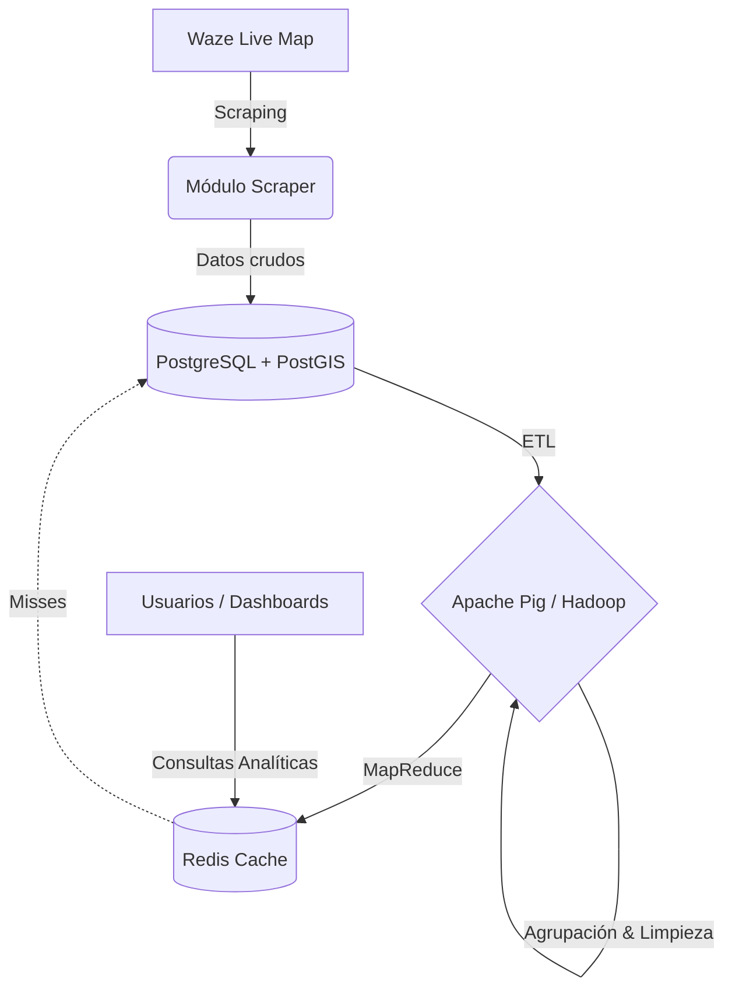

# Plataforma Distribuida de Análisis de Tráfico (Región Metropolitana)


Un sistema distribuido completo (End-to-End) capaz de extraer eventos de tráfico en tiempo real desde _Waze_, almacenarlos de forma persistente, y procesarlos mediante un pipeline de Big Data para apoyar la toma de decisiones viales en las 52 comunas de la Región Metropolitana de Santiago.

---

## Arquitectura del Sistema

La plataforma está diseñada bajo un paradigma de microservicios contenerizados, separando claramente la extracción, el almacenamiento transaccional, el procesamiento pesado y la entrega rápida de datos.



## ¿Qué hace este proyecto?

Este proyecto académico e industrial se divide en dos grandes fases de ingeniería:

- **Parte 1**: Recolección y Caché Operacional
  Automatización de la extracción de eventos (accidentes, congestión) desde el mapa en vivo de Waze mediante Selenium. Los datos se almacenan en PostgreSQL. Se implementó un simulador de tráfico sintético para probar el rendimiento de una caché Redis utilizando políticas LRU y LFU, demostrando cómo reducir la carga de la base de datos ante picos masivos de usuarios (Flash Crowds).

- **Parte 2**: Big Data y Caché Analítico
  Escalamiento del sistema para cubrir las 52 comunas de la región. Se implementó un pipeline ETL para homogeneizar geográficamente los datos (agrupando incidentes cercanos). Posteriormente, se utilizó Apache Pig (Hadoop) para procesar cientos de miles de registros, calculando tendencias temporales y frecuencias por comuna. Finalmente, los resultados pesados se inyectaron de vuelta a Redis para asegurar entregas en tiempos de sub-milisegundos.

## Stack Tecnológico

Lenguaje Base: Python 3.x

- **Web Scraping**: Selenium WebDriver

- **Base de Datos Relacional**: PostgreSQL 15 + PostGIS (Datos geoespaciales)

- **Caché en Memoria**: Redis 7.0

- **Big Data & Procesamiento**: Apache Pig sobre Hadoop (MapReduce)

- **Infraestructura**: Docker & Docker Compose

- **Análisis de Datos**: Pandas & Matplotlib

## Impacto y Resultados (Prueba de Estrés)

Para validar la arquitectura, el sistema fue sometido a una prueba de estrés continua de 10 horas (5 por servicio) consultando métricas analíticas contra más de 1.000.000 de registros.


### Conclusión del Experimento:

Mientras que calcular agregaciones masivas al vuelo en PostgreSQL (GROUP BY) genera latencias inestables, el uso de nuestra capa de Caché Analítico (Redis) mantiene la latencia estable en un promedio ultra-rápido de 0.27 milisegundos, superando consistentemente al motor relacional y garantizando alta disponibilidad.

## Guía de Uso Rápido (Quickstart)

Sigue estos pasos para levantar la infraestructura completa y replicar el experimento de Big Data en tu máquina local.

1. **Levantar la Infraestructura Base**

```bash
git clone [https://github.com/RicketyMajor/waze-sistemas-distribuidos.git](https://github.com/RicketyMajor/waze-sistemas-distribuidos.git)
cd waze-sistemas-distribuidos
python -m venv venv
source venv/bin/activate
pip install -r requirements.txt

# Iniciar PostgreSQL y Redis
docker-compose up -d
```

2. **Recolectar Datos**
   Ejecuta el scraper para obtener datos reales de Waze (presiona Ctrl+C para detenerlo cuando desees).

```bash
python -m scraper/waze_scraper.py
```

3. **Pipeline de Procesamiento y Visualización (End-to-End)**
   Ejecuta el flujo completo automatizado: limpieza de datos, MapReduce con Apache Pig, carga a memoria caché y envío al motor de búsqueda para visualización.

```bash
# Ejecutar el orquestador completo
./run_pipeline.sh
```

4. **Simulación de Estrés**
   Ejecuta el bombardeo de consultas analíticas (1 hora por servicio).

```bash
# Prueba 1: PostgreSQL
docker-compose run --rm -e EXPERIMENT_NAME="postgres_1hr" -e TRAFFIC_TYPE="analytical" -e DATA_SOURCE="postgres" -e EXPERIMENT_DURATION="1.0" traffic-app python -m traffic_generator.generator

# Prueba 2: Redis
docker-compose run --rm -e EXPERIMENT_NAME="redis_1hr" -e TRAFFIC_TYPE="analytical" -e DATA_SOURCE="redis" -e EXPERIMENT_DURATION="1.0" traffic-app python -m traffic_generator.generator
```

5. Generar los Gráficos de Resultados

```bash
python plot_results.py
```

Los gráficos se guardarán automáticamente en la carpeta results/.

## Documentación Técnica

Para un análisis matemático profundo y la justificación técnica de las decisiones arquitectónicas, consulta nuestros reportes formales:

- [Análisis de Rendimiento Parte 1 (LRU vs LFU)](documentation/Part_1.md)
- [Informe Técnico Parte 2 (Pipeline Big Data y Caché Analítico)](documentation/Part_2.md)
