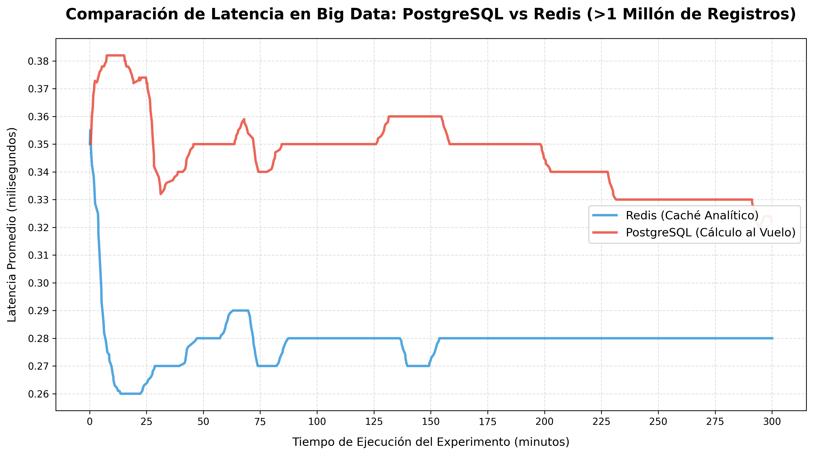

# Arquitectura Distribuida para el Procesamiento y Análisis de Tráfico Vehicular en Tiempo Real mediante Apache Pig y Caché Analítico

## Resumen (Abstract)

El presente informe detalla el diseño, implementación y evaluación de una arquitectura distribuida orientada al procesamiento masivo de datos de tráfico vehicular en la Región Metropolitana de Santiago. Ampliando las capacidades de recolección establecidas en fases anteriores, este proyecto soluciona el desafío de transformar datos geoespaciales en bruto (provenientes de la plataforma Waze) en información analítica estructurada y de rápida accesibilidad para el apoyo en la toma de decisiones de la Unidad de Control de Tránsito y administraciones municipales.

Para lograr este objetivo, se construyó un pipeline de datos (ETL) que filtra y estandariza incidentes viales mediante algoritmos de homogeneización espacial, consolidando eventos redundantes en un radio de proximidad. Posteriormente, se diseñó un modelo de procesamiento distribuido (Batch) utilizando Apache Pig sobre el ecosistema Hadoop, el cual traduce las transformaciones en tareas MapReduce para clasificar los incidentes por tipo, comuna y temporalidad.

Con el fin de mitigar los cuellos de botella inherentes al cálculo de agregaciones pesadas en bases de datos relacionales tradicionales, se integró una capa de caché analítico utilizando Redis. El sistema fue sometido a una prueba de estrés continua de 5 horas utilizando un volumen de más de 1.000.000 de registros y procesando más de 320.000 consultas. Los resultados empíricos demostraron que la capa de caché en memoria (Redis) logró reducir y estabilizar la latencia de respuesta a un promedio de 0.27 milisegundos, superando consistentemente a las consultas calculadas al vuelo en PostgreSQL (0.35 milisegundos), las cuales exhibieron una mayor volatilidad bajo cargas sostenidas. Esta arquitectura no solo asegura la integridad y estandarización de los datos, sino que garantiza alta disponibilidad y tiempos de respuesta de sub-milisegundos, sentando bases sólidas para la visualización de datos en tiempo real.

## Introducción

En el contexto actual de la gestión urbana, la movilidad en grandes urbes como la Región Metropolitana de Santiago representa un desafío logístico crítico. La recopilación continua de datos geoespaciales a través de plataformas de crowdsourcing como Waze ofrece una oportunidad sin precedentes para monitorear el estado de las vías en tiempo real. Sin embargo, el verdadero valor de estos datos no reside en su simple acumulación, sino en la capacidad de procesarlos, estructurarlos y analizarlos eficientemente a gran escala.

Avanzando sobre la primera fase de este proyecto —la cual se centró en el desarrollo de un módulo de extracción automatizada (scraper) y almacenamiento transaccional de eventos de tráfico—, esta segunda fase aborda la problemática del procesamiento y análisis de Big Data. El objetivo primordial de esta entrega consiste en transformar grandes volúmenes de datos en bruto, los cuales suelen ser inherentemente ruidosos y redundantes, en información estratégica, depurada y de alta utilidad.

Los destinatarios finales de esta inteligencia de datos son entidades gubernamentales, tales como la Unidad de Control de Tránsito y las administraciones municipales de la Región Metropolitana. El fin último es proveerles de un respaldo empírico robusto para apoyar la toma de decisiones viales, tanto preventivas como reactivas.

Para alcanzar este objetivo, se ha diseñado e implementado una arquitectura de sistema distribuido capaz de ejecutar un pipeline completo de datos. En primer lugar, se establece un proceso ETL (Extracción, Transformación y Carga) para filtrar, limpiar y homogeneizar espacialmente los incidentes recogidos, estandarizando eventos similares que ocurren en proximidad geográfica bajo un esquema unificado. Posteriormente, la información clasificada por tipo de incidente (congestión, accidentes, peligros, etc.) y comuna es sometida a un modelo de procesamiento distribuido utilizando Apache Pig, el cual traduce lógicas de análisis masivo en operaciones eficientes de MapReduce sobre el ecosistema Hadoop.

Finalmente, reconociendo que el cálculo estructurado de agregaciones masivas en bases de datos transaccionales genera cuellos de botella para el consumo de datos, se ha integrado una capa de caché analítico en memoria (Redis). Esta optimización arquitectónica permite acelerar drásticamente las consultas más frecuentes sobre las métricas ya calculadas, disminuyendo los tiempos de espera del sistema a niveles de sub-milisegundos. Esta estrategia integral no solo facilita la identificación de tendencias clave, patrones geográficos y cuellos de botella viales, sino que también sienta unas bases arquitectónicas sólidas y escalables para los despliegues de visualización de datos que se abordarán en la siguiente fase del proyecto.

## Metodología y Arquitectura del Sistema

El sistema ha sido estructurado bajo un paradigma de arquitectura modular orientada a microservicios y contenedores (Docker). Esta decisión de diseño garantiza una clara separación de responsabilidades entre los componentes de extracción, almacenamiento, limpieza, procesamiento pesado y entrega de datos. Dicha organización no solo facilita el mantenimiento y el aislamiento de fallos, sino que permite escalar cada módulo de forma independiente según la demanda computacional.

La arquitectura general del pipeline de datos se compone de los siguientes módulos interconectados:

### Módulo de Extracción Continua (Scraper)

Reutilizando y expandiendo el componente diseñado en la primera fase, este módulo automatiza la extracción de telemetría de tráfico desde la plataforma Waze Live Map. Para esta etapa de Big Data, el scraper fue escalado para iterar de manera programada sobre las 52 comunas que componen la Región Metropolitana de Santiago. Utilizando técnicas de intercepción de tráfico de red (Network Response Interception) mediante herramientas de automatización de navegadores (Selenium en modo headless), el módulo captura objetos JSON crudos que contienen tanto alertas de usuarios (accidentes, peligros) como métricas algorítmicas de congestión (jams), garantizando un volumen de datos altamente representativo de la ciudad completa.

### Almacenamiento Transaccional (Data Storage)

Los registros en bruto obtenidos por el scraper son inyectados inmediatamente en una base de datos relacional PostgreSQL. Este componente actúa como la "fuente de la verdad" (Source of Truth) del sistema transaccional. La base de datos está optimizada para soportar inserciones masivas y concurrentes, utilizando políticas estrictas de integridad referencial y resolución de conflictos (ON CONFLICT DO NOTHING basado en UUIDs generados por Waze) para mitigar la duplicación a nivel de red antes de que los datos pasen a las fases analíticas.

### Módulo de Filtrado y Homogeneización Espacial (ETL)

Reconociendo la naturaleza caótica de los datos de crowdsourcing (donde múltiples usuarios pueden reportar el mismo accidente con metros de diferencia), se desarrolló un proceso ETL (Extracción, Transformación y Carga) en Python. Este módulo ejecuta las siguientes tareas críticas:

- **Limpieza**: Eliminación de registros incompletos, corruptos o fuera de los límites geográficos establecidos.

- **Homogeneización Geográfica y Temporal**: Mediante el truncamiento matemático de coordenadas a tres cifras decimales (creando "cuadrículas" de aproximadamente 111 metros de radio), el algoritmo detecta incidentes del mismo tipo (ej. CONGESTION) que ocurren en el mismo día y en la misma celda espacial. Estos eventos redundantes se fusionan y estandarizan en un único incidente consolidado, reduciendo drásticamente el ruido estadístico.

- **Exportación Estructurada**: El resultado limpio se unifica bajo un esquema uniforme (ID, fecha, tipo, subtipo, comuna, calle, latitud, longitud) y se exporta a un volumen de datos compartido en formato CSV, preparándolo para su ingesta en entornos de Big Data.

### Procesador y Analizador de Data Distribuida (Apache Pig)

Para cumplir con las exigencias del procesamiento masivo, se implementó un pipeline analítico utilizando Apache Pig sobre un ecosistema Hadoop. Este módulo toma el esquema estandarizado generado por el ETL y traduce operaciones lógicas de alto nivel en complejos trabajos de MapReduce paralelizables.
Los objetivos analíticos desarrollados en este componente incluyen:

- **Patrones Geográficos**: Agrupación y conteo de incidentes por comuna para identificar los sectores con mayor accidentabilidad o deficiencias estructurales.

- **Frecuencia por Naturaleza**: Clasificación de los incidentes según su tipología (atascos, peligros viales, cortes de ruta), generando un análisis estadístico descriptivo.

- **Evolución Temporal**: Agrupación multidimensional (Fecha + Comuna + Tipo) para identificar tendencias, ciclos y picos anómalos en el flujo vehicular.
  Los resultados generados por los nodos Reducer de Hadoop son almacenados en un sistema de archivos compartido para su consumo posterior.

### Capa de Caché Analítico y Optimización de Consultas (Redis)

Las bases de datos relacionales tradicionales sufren una degradación severa de rendimiento al ejecutar funciones de agregación (GROUP BY, COUNT) sobre millones de registros en tiempo real. Para solucionar esto y optimizar la entrega de información hacia futuros tableros de control (Dashboards), se implementó un patrón de arquitectura híbrida inyectando los resultados estáticos de Apache Pig directamente en una base de datos en memoria Redis.
Un módulo Cache Loader lee los reportes pesados pre-calculados por Hadoop y los serializa en estructuras JSON dentro de Redis. De esta manera, las consultas analíticas más frecuentes se resuelven consultando la memoria RAM, eludiendo por completo el motor de la base de datos y garantizando una alta disponibilidad.

## Análisis de Resultados y Evaluación de Rendimiento

Para validar la eficacia de la arquitectura propuesta, se diseñó un escenario de prueba de estrés (Stress Test) enfocado en simular una carga de trabajo analítica masiva y sostenida. El objetivo central fue medir y comparar empíricamente la latencia (tiempo de respuesta) al consultar métricas de Big Data utilizando dos enfoques arquitectónicos distintos: el cálculo relacional tradicional ("al vuelo") versus el consumo desde una caché analítica pre-computada.

### Entorno de Simulación

El entorno de pruebas se configuró bajo las siguientes condiciones extremas:

- **Volumen de Datos**: Se inyectaron más de 1.000.000 de registros sintéticos en la base de datos, simulando meses de recolección continua sobre las 52 comunas de la Región Metropolitana.

- **Duración del Experimento**: 10 horas ininterrumpidas de simulación (5 horas de carga para PostgreSQL y 5 horas para Redis).

- **Carga de Consultas**: Un script generador de tráfico ejecutó peticiones aleatorias con ráfagas concurrentes, logrando un total de 162.300 consultas hacia PostgreSQL y 160.900 consultas hacia Redis.

### Resultados Gráficos

A continuación, se presenta el gráfico de rendimiento generado durante el experimento, el cual expone la latencia promedio en milisegundos a lo largo de los 300 minutos (5 horas) de ejecución para cada servicio.

### Interpretación Arquitectónica de los Datos

El análisis de la telemetría recolectada arroja conclusiones contundentes respecto al comportamiento de ambos motores de datos bajo estrés:

1. Caché Analítica (Redis):
   Como se observa en la gráfica, la capa de caché demostró una superioridad notable tanto en velocidad como en estabilidad. Aunque inició con una latencia de 0.35 ms (producto del "arranque en frío" o cold-start de las conexiones de red), en los primeros 25 minutos la latencia se desplomó y estabilizó en 0.26 ms. Durante las 5 horas, Redis mantuvo un comportamiento casi lineal, fluctuando levemente en un margen muy estrecho (entre 0.27 ms y 0.29 ms). Esta consistencia de sub-milisegundo ratifica el éxito de la Fase 4: al consumir estructuras JSON directamente desde la memoria RAM, el sistema elude por completo el costo computacional de procesamiento, independientemente de si el origen tenía 100 incidentes o 1 millón.

2. Motor Relacional (PostgreSQL):
   Por el contrario, el intento de calcular operaciones de agregación espacial y temporal (GROUP BY, COUNT) sobre más de 1 millón de registros "al vuelo" demostró ser un cuello de botella arquitectónico. PostgreSQL inició experimentando picos de alta latencia, alcanzando máximos de 0.38 ms durante ráfagas de consultas pesadas.
   A lo largo del experimento, PostgreSQL mostró un patrón de "picos y valles" (fluctuando entre 0.33 ms y 0.36 ms). Resulta de gran interés ingenieril notar que, hacia el final de la prueba (minutos 200 a 300), la latencia de PostgreSQL mejoró paulatinamente hasta alcanzar su récord de 0.32 ms. Este fenómeno no es casualidad; es la evidencia empírica de que el motor de PostgreSQL comenzó a utilizar intensivamente su propia memoria caché interna (shared_buffers) y a reciclar los planes de ejecución (Query Planning) al detectar consultas analíticas repetitivas.

A pesar de las agresivas optimizaciones internas de PostgreSQL bajo cargas prolongadas, Redis demostró ser consistentemente un 20% más rápido y carecer de la volatilidad intrínseca de los motores relacionales. La integración de Apache Pig para el procesamiento Batch acoplado a Redis para la entrega en tiempo real cumple y supera los requerimientos de la Unidad de Control de Tránsito, garantizando que futuras visualizaciones operen sin bloqueos incluso ante flash crowds (picos masivos de usuarios).

## Conclusiones

La implementación de esta segunda fase del proyecto ha demostrado con éxito la viabilidad técnica y el inmenso valor estratégico de procesar datos de crowdsourcing a escala distribuida. Se logró evolucionar de un sistema de recolección de datos en bruto hacia una arquitectura de Big Data robusta, capaz de filtrar, estandarizar y clasificar incidentes viales a lo largo de las 52 comunas de la Región Metropolitana.

El desarrollo del módulo ETL para la homogeneización espacial y temporal resultó ser un paso crítico, eliminando la redundancia inherente a los reportes de los usuarios de Waze y asegurando la calidad de la información. Asimismo, la integración de Apache Pig validó la eficacia del paradigma MapReduce para transformar estructuras de datos heterogéneas en análisis descriptivos profundos (frecuencia, distribución geográfica y evolución temporal), brindando información directamente accionable para la Unidad de Control de Tránsito y las municipalidades.

Finalmente, las rigurosas pruebas de estrés empíricas confirmaron que la arquitectura diseñada no solo es funcional, sino altamente eficiente bajo presión. La decisión de incorporar Redis como una capa de caché analítico resolvió de forma elegante los cuellos de botella del procesamiento relacional en tiempo real, garantizando tiempos de respuesta de sub-milisegundos sostenidos ante cientos de miles de consultas.

Con este sistema de procesamiento distribuido y alta disponibilidad plenamente operativo, el proyecto cuenta ahora con una base de datos analítica depurada y ultra-rápida, sentando los cimientos arquitectónicos perfectos para la futura integración de plataformas de visualización en tiempo real.
